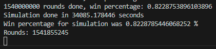
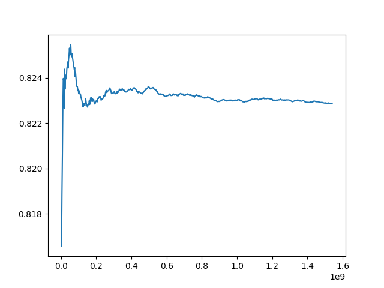
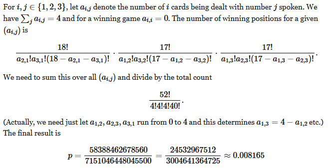

# 123-game

## Intro

The 123-game is a luck-based card game played by one player. The game starts by shuffling a standard deck of cards. Then, the cards are are lifted onto the table from the top of the pack, while counting from one to three and repeating (1,2,3,1,2,3...). 

The aim of the game is to clear the whole pack such that you never lift a card matching the number you are counting. So when counting one, you cannot lift an ace, when counting two, you cannot lift a two, and when couting three, you cannot lift a three. All other cards do not matter. 

When playing the game a couple of times, it quickly becomes apparent that most of the games will end in a failure when shuffling the pack at random. This is somewhat unintuitive, as it would seem most of the packs would result in a win, but the reality is quite the opposite. 

To this end, an interesting question arises - **given a randomly shuffled pack of cards, what is the probability that you will win the game with that pack?**

The following is a brief investigation into a problem that has bothered me for the better part of ten years. 

## Attempts at calculation

Calculating the exact win probability for the 123-game by hand is a combinatorial nightmare. 

The core challenge lies in the sheer number of losing conditions and their complex overlaps. While the total number of arrangements is a straightforward ($`52!`$), counting the winning hands requires us to subtract all the losing ones.

A standard method for this is the Principle of Inclusion-Exclusion, which would be a monumental task here. We'd have to count every possible scenario where an Ace is in a "1-spot", a Two in a "2-spot", or a Three in a "3-spot." Then, we would have to systematically subtract all the double-counts (e.g., an Ace in a "1-spot" AND a Two in a "2-spot"), add back the triple-counts, and so on. Given that we have 12 specific cards (4 of each) and 52 total positions, the number of overlapping conditions is astronomically large.

Time after time, I have tried estimating this calculation, but to no avail. Due to my frustration, I turned to the modern, simple, and most of all, lazy solution of using a Monte Carlo simulation. 

## Monte Carlo approach

A simple approach to estimating the probability of winning the game is to simulate a large number of games to see what amount of the games result in a win/loss. In statistics, this is referred to as a Monte Carlo simulation. It is also referred to as being lazy and not knowing how to calculate stuff, but that is a title I am willing to take. 

The Monte Carlo simulation could be done by doing the following: 

1. Generate a random pack of cards (sequence of numbers 1-13, where each number appears four times). 
    1. If the pack fulfills any of the following conditions, it is a failed game: 
        1. A 1 is in any position 1, 4, 7, 10, 13... (3n + 1 for n = 0,1,2,3...)
        2. A 2 is in any position 2, 5, 8, 11, 14... (3n+2 for n= 0,1,2,3...)
        3. A 3 is in any position 3, 6, 9, 12, 15... (3n+3 for n = 0,1,2,3...)
    1.  If none of these conditions are filled, the pack is a winning pack. 

By running the file `brute.py` (excuse my messy code), we can get an estimation of the correct win percentage of the game.

When running the simulation for 1.5 billion rounds, the percentage converged to $0.8228...\%$, suggesting that the win probability is less than one percent.

## Validation

Although I believed earlier that the problem was novel, thanks to the great power of GenAI, I discussed with it a bit and found a [Math Stackexchange conversation](https://math.stackexchange.com/questions/414023/probability-of-winning-the-game-1-2-3) that handled the exact same issue. 

The thread contained some discussion, but the most upvoted answer contained the following calculation of the probability (courtesy of [Hagen von Eitzen](https://math.stackexchange.com/users/39174/hagen-von-eitzen)): 

This result is relatively close to the result of the Monte Carlo approach, which increase the validity of the answer. Moreover, it is possible that the Monte Carlo simulation would need a larger numbers of iterations to converge completely, which could explain the difference, but the ballpark seems to be same, which is good enough for me. 

So, 10 years later after hearing about the problem, several hours of calculations, one hacky Python experiment & an AI revolution later, I finally know the answer to the question.

My initial though was calculating the same probability for playing the $1, 2, 3, ..., N$-variant of the game, but that will have to wait for now. 